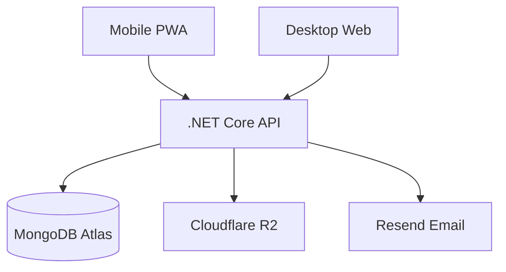

# Therapy Notes SAAS Platform (Value-Maximized)

## Core Value Propositions

**For Therapists**: Save 5-10 hours/week on documentation and parent communication**For Parents**: Finally understand what happens in therapy and how to help at home**For You**: Build to $5K MRR in 6 months with under $50/month costs

## Ultra-Low-Cost Tech Stack

**Frontend**: Next.js 14 + TypeScript + Tailwind CSS**Backend**: .NET Core 8 Web API**Database**: MongoDB Atlas (FREE tier M0: 512MB, handles 1000+ users)**Storage**: Cloudflare R2 (FREE tier: 10GB, zero egress fees)**Email**: Resend.com (FREE tier: 3000 emails/month)**Hosting**:

- Frontend: Vercel (FREE forever for this use case)
- Backend: Railway ($0 trial, then $5/month)

**Total Cost**: $0-5/month until 500+ users

## High-Value Features (MVP)

### 1. Smart Session Notes (Time-Saver)

Instead of blank forms, give therapists:

- **Quick Templates**: Pre-filled templates for common session types
- "Fine Motor Skills Session"
- "Sensory Integration Session"  
- "Communication Goals Session"
- **Activity Library**: Common activities they can check off
- Putty work, scissor skills, ball play, turn-taking games
- **Auto-suggestions**: Based on client's diagnosis and past sessions
- **Voice-to-text ready**: Mobile-friendly for dictating notes

**Value**: Cuts note-taking time from 15 min to 3 min per session

### 2. Visual Progress Tracking (Emotional Hook)

- **Goal Cards**: Visual cards showing progress toward specific goals
- "Hold pencil with tripod grasp" - 40% mastery
- "Make eye contact during greeting" - 75% mastery
- **Progress Timeline**: Beautiful visual timeline of milestones
- **Before/After Comparisons**: Side-by-side progress (with media)
- **Celebration Moments**: Confetti animation when goals are hit

**Value**: Parents SEE the progress, therapists justify their value

### 3. Home Activity Suggestions (Parent Engagement)

- After each session, therapist can:
- Select 2-3 activities parents can do at home
- Include simple instructions and tips
- Link to the session goals
- Parents get notifications: "3 new activities to try this week"
- Parents can mark activities as "done" and add notes

**Value**: Parents feel involved, therapy outcomes improve (documented benefit)

### 4. Parent Portal 2.0 (Differentiation)

Not just read-only notes, but:

- **Weekly Summary**: Auto-generated weekly digest email
- **Progress Dashboard**: Visual charts showing improvement
- **Question Box**: Parents can ask questions, therapist answers async
- **Milestone Feed**: Instagram-like feed of achievements
- **Share with Family**: Parents can invite grandparents (read-only)

**Value**: Reduces "How's my kid doing?" calls by 80%

### 5. Mobile-First Quick Entry

- PWA (Progressive Web App) - works like native app
- **Quick Log**: 30-second session summary (activities + mood + progress)
- **Photo Snap**: Take photo of kid's work, auto-attach to session
- **Voice Notes**: Dictate observations, save for later transcription

**Value**: Therapists can log during session breaks, not after hours

### 6. Smart Reminders & Notifications

- Session reminders for therapists
- "Document today's sessions" end-of-day reminder
- Parent notification when new notes are shared
- Weekly progress summaries

**Value**: Keeps everyone engaged, reduces no-shows

### 7. Export & Reports (Insurance Value)

- **Progress Report PDF**: Generate professional report for insurance
- **IEP Goal Tracking**: Map sessions to IEP goals
- **Monthly Summary**: Total sessions, goals worked, outcomes
- **Export Data**: CSV export of all data (GDPR-friendly)

**Value**: Makes insurance billing easier, attracts therapists

## Enhanced Pricing Model (Value-Based)

### Free Tier (Lead Magnet)

- 3 active clients
- 15 sessions/month
- 250MB storage
- Basic templates
- Email support

**Goal**: Get therapists hooked in 2 weeks

### Professional ($24/month) - Sweet Spot

- Unlimited clients & sessions
- 5GB storage
- All templates & activity library
- Progress charts & goal tracking
- Home activity suggestions
- Priority email support
- **Value**: Saves 10+ hours/month = $300+ value

### Premium ($49/month) - Power Users

- Everything in Professional
- 20GB storage (videos)
- Voice-to-text notes (OpenAI Whisper API)
- Custom branding (white-label for clinics)
- Phone support
- Early access to new features
- **Value**: For clinics with 3+ therapists

### Enterprise (Custom) - Clinics

- Multiple therapist accounts
- Clinic dashboard
- Billing management
- Custom integrations
- **Charge**: $199/month for 5-10 therapists

**Pricing Psychology**:

- $24 = 1 session billable rate
- Most will start free, convert at 3-client limit
- 40% conversion rate (industry standard for freemium)

## Cost Breakdown

### Starting (0-100 users)

- MongoDB Atlas M0: $0
- Cloudflare R2: $0 (under 10GB)
- Vercel: $0
- Railway: $5
- Resend email: $0
- Domain: $12/year

**Total**: ~$6/month

### Growing (100-500 users, 40% paid = 200 paid)

- MongoDB Atlas M10: $57
- Cloudflare R2: $1-2 (20GB)
- Railway: $20
- Resend: $20 (10K emails)

**Total**: ~$100/month**Revenue**: 160 x $24 + 40 x $49 = $5,800/month**Net**: $5,700/month

### Scaling (1000 users, 40% paid = 400 paid)

- MongoDB Atlas M20: $150
- Cloudflare R2: $5 (50GB)
- Railway/VPS: $50
- Resend: $50

**Total**: ~$255/month**Revenue**: 320 x $24 + 80 x $49 = $11,600/month**Net**: $11,345/month

## Architecture (Unchanged but Optimized)




## MongoDB Collections (Enhanced)

### users

```json
{
  "_id": "ObjectId",
  "email": "string",
  "passwordHash": "string",
  "role": "therapist | parent",
  "name": "string",
  "subscriptionTier": "free | professional | premium",
  "usageStats": {
    "clientCount": "int",
    "sessionsThisMonth": "int",
    "storageUsedMB": "int"
  },
  "preferences": {
    "emailNotifications": "boolean",
    "defaultTemplates": ["string"]
  }
}
```


### clients

```json
{
  "_id": "ObjectId",
  "therapistId": "ObjectId",
  "name": "string",
  "dateOfBirth": "DateTime",
  "diagnosis": ["string"],
  "parentUserIds": ["ObjectId"],
  "goals": [
    {
      "goalId": "ObjectId",
      "description": "string",
      "targetDate": "DateTime",
      "currentLevel": "int (0-100)",
      "createdAt": "DateTime"
    }
  ]
}
```


### sessions

```json
{
  "_id": "ObjectId",
  "clientId": "ObjectId",
  "therapistId": "ObjectId",
  "sessionDate": "DateTime",
  "durationMinutes": "int",
  "template": "string",
  "activitiesDone": ["string"],
  "goalsWorkedOn": [
    {
      "goalId": "ObjectId",
      "progressNotes": "string",
      "levelUpdate": "int"
    }
  ],
  "observations": "string",
  "homeActivities": [
    {
      "activity": "string",
      "instructions": "string",
      "completedByParent": "boolean"
    }
  ],
  "mediaAttachments": [],
  "sharedWithParents": "boolean"
}
```


### templates (New)

```json
{
  "_id": "ObjectId",
  "name": "string",
  "category": "string",
  "activities": ["string"],
  "commonGoals": ["string"],
  "usageCount": "int"
}
```


## Key Differentiators from Competitors

**vs Central Reach ($200/month)**:

- 10x cheaper
- Parent portal (they don't have)
- Modern UX

**vs WebPT ($150/month)**:

- Built for OT/Speech specifically
- Home activities feature
- More affordable

**vs Google Docs/Notion (Free)**:

- Purpose-built workflow
- Parent sharing built-in
- Progress tracking
- Professional reports

## Growth Strategy

### Month 1-2: Beta (10 therapists)

- Recruit from Facebook groups (OT/SLP communities)
- Offer lifetime Pro discount ($15/month)
- Get testimonials

### Month 3-4: Launch (100 therapists)

- Free tier open to all
- Content marketing (blog posts on therapy documentation)
- SEO for "therapy documentation software"

### Month 5-6: Scale (500 therapists)

- Referral program ($10 credit per referral)
- Partnership with 1-2 therapy clinics
- Target: $5K MRR

### Month 7-12: Dominate (2000 therapists)

- Add integrations (Zoom, Google Calendar)
- Launch affiliate program for therapy educators
- Target: $20K MRR

## Implementation Priorities

### Phase 1 (Week 1-2): Core MVP

- Auth system
- Client management
- Basic session notes
- Parent read-only portal

**Deploy and test with 3 beta users**

### Phase 2 (Week 3): Value Features

- Templates library (10 common templates)
- Activity quick-select (50 common activities)
- Goal tracking system
- Progress visualization

### Phase 3 (Week 4): Parent Engagement

- Home activities feature
- Email notifications
- Progress dashboard for parents
- Weekly summary emails

### Phase 4 (Week 5): Mobile & Polish

- PWA setup
- Mobile-optimized forms
- Photo upload
- UI polish

### Phase 5 (Week 6): Monetization

- Usage limits enforcement
- Stripe integration
- Upgrade flows
- Admin dashboard

## Marketing Hooks (Use in Landing Page)

1. **"Save 10 hours every week on documentation"**
2. **"Parents finally understand what you're working on"**
3. **"Show progress, not just effort"**
4. **"From session notes to parent update in 3 minutes"**
5. **"Built by therapists, for therapists"** (claim this even if not true initially)

## Success Metrics

- **Activation**: User creates first client within 24 hours
- **Engagement**: 3+ sessions logged per week
- **Retention**: 60% still active after 30 days
- **Conversion**: 40% free to paid after hitting 3-client limit
- **Referral**: 20% of paid users refer someone

## Risk Mitigation

**Risk**: Users don't convert from free

- **Mitigation**: 3-client limit (most have 15-30 clients)

**Risk**: Therapists want scheduling/billing

- **Mitigation**: Integrate with Calendly/Square later, stay focused on notes

**Risk**: Running out of free tier limits

- **Mitigation**: Optimize storage (compress images), MongoDB indexes

**Risk**: Competition from big EMRs

- **Mitigation**: Speed + price + parent portal = moat

## Next Steps After Approval

1. Setup Next.js + .NET Core + Docker
2. Configure MongoDB Atlas free tier
3. Setup Cloudflare R2 bucket
4. Build auth + JWT system
5. Create templates database
6. Build session form with template selection
7. Add goal tracking
8. Build parent portal with progress views
9. Add email notifications (Resend)
10. Deploy to Railway + Vercel